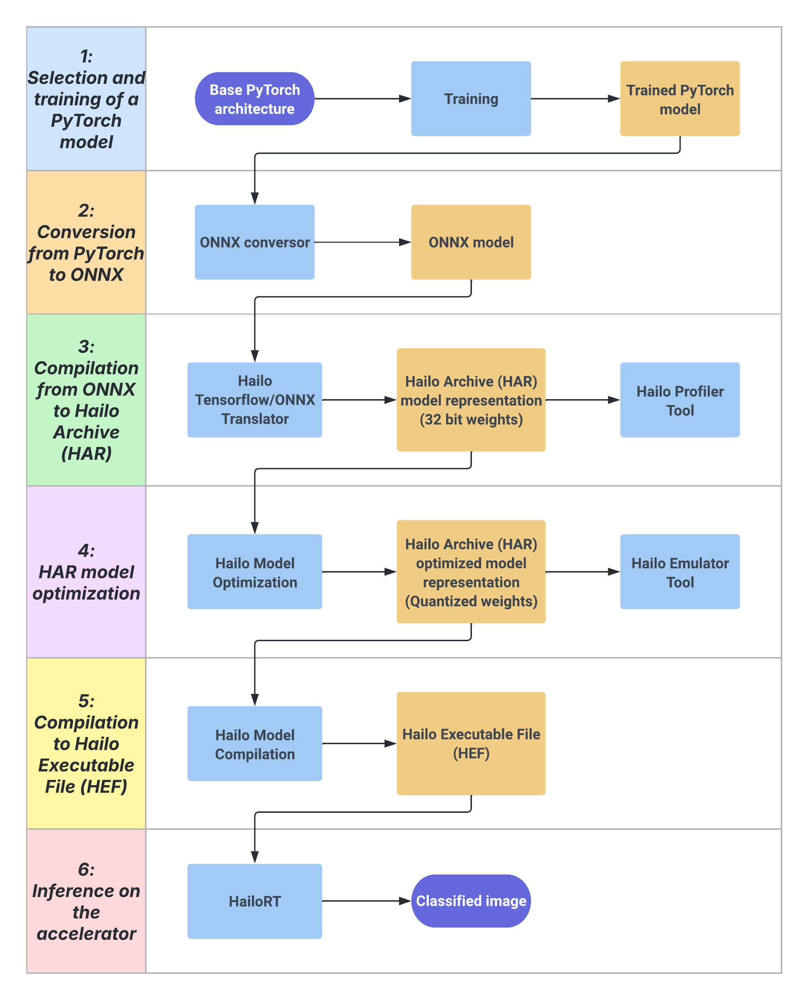

# hyper-rpi
## Hyperespectral Image Classification on Raspberry Pi 5 with Hailo 8L AI Accelerator

This project aims to adapt hyperespectral image classification deep learning models to be able to run on a Raspberry Pi 5 with the Hailo 8L AI Accelerator module. This system allows inference on edge devices with low power consumption and reasonable runtimes, while maintainig acceptable accuracy. To achieve that goal, a translation and compilation pipeline is proposed.

## Project Features

- **Adaptation to spcecific hardware**: The project adapts hyperespectral image classification deep learning models to run on Raspbery Pi 5, using the Hailo 8L to optimize inference performance.

- **Optimized processing pipeline**: A processing pipeline is designed to maximize performance on the Raspberry Pi 5, ensuring low execution times, efficient resource usage and acceptable accuracy. It also provides support to different optimization and compression levels.

- **Performance evaluation**: The project provides an evaluation system that focuses on inference speed and accuracy.

## Main pipeline



This image shows the full pipeline that goes from training a deep learning model to classify hiperespectral images to a compiled model that can be executed on Hailo 8L hardware. To exemplify, two deep learning architectures were used as an example: a *CNN* and a *Residual Balancing GAN* (https://github.com/alvrogd/ResBaGAN).

## Environments creation

Environments can be splitted in two groups: Build environments (Created on a GPU machine) that can be found in *envs/build_environments/* and Inference environments (Created on the Raspberry Pi) that can be found in *envs/runtime_environments/*. 

### Build environments

These environments are used to train, optimize and compile the models. To complete the optimization phase, it is neccesary to have a machine with CUDA compatible GPU. The following software is required:

- **Conda**: It can be installed from (https://docs.conda.io/projects/conda/en/latest/index.html).

- **Nvidia driver version 525, CUDA 11.8 and CUDNN 8.9**: They can be obtained from (https://developer.nvidia.com/).

- **Hailo Dataflow Compiler version 3.31.0, HailoRT versions 4.21.0 (For the GPU machine) and 4.20.0 (For the Raspberry Pi)**: They can be downloaded from (https://hailo.ai/developer-zone/software-downloads/), but it is necessary to create a developer account.

1. Training enviroment: hyper_env

This environment is used on phases 1 and 2 for PyTorch training and conversion to ONNX. It can be created with the following command:

```
conda env create -f hyper_env.yaml
```

2. Compilation enviroment: hailo_env

This environment is used on phases 3 and 5 for ONNX to HAR translation and HAR to HEF compilation. It can be created with the following command:

```
conda env create -f hailo_env.yaml
```

It is also neccesary to install two of the Hailo additional packages with pip:

```
pip install hailo_dataflow_compiler-3.31.0-py3-none-linux_x86_64.whl
pip install hailort-4.21.0-cp38-cp38-linux_x86_64.whl
```

3. Optimization enviroment: hailo_gpu_env

This environment is used on phase 3 for model optimization. It includes the necessary packages to execute the optimization opperations with CUDA . It can be created with the following command:

```
conda env create -f hailo_gpu_env.yaml
```

It is also neccesary to install two of the Hailo additional packages with pip:

```
pip install hailo_dataflow_compiler-3.31.0-py3-none-linux_x86_64.whl
pip install hailort-4.21.0-cp38-cp38-linux_x86_64.whl
```

### Inference environments

These environmets are used to execute the inference on the Raspberry Pi with Hailo 8L. They are created with venv for simplicity, so a Python 3.11 instalation is required (https://www.python.org/downloads/). Before creating the environments, it is necessary to install Hailo drivers on the Raspberry Pi following this guide (https://www.raspberrypi.com/documentation/computers/ai.html#getting-started)

1. Inference enviroment without accelerator: hyper_rpi_env

This environment is created to execute the inference without the usage of the Hailo 8L. It can be created with the following commands:

```
python -m venv hyper_rpi_env
source hyper_rpi_env/bin/activate
pip install -r requirements_hyper_rpi_env.txt
```

2. Inference enviroment with accelerator: hailo_rpi_env

This environment is created to execute the inference using the Hailo 8L accelerator. It can be created with the following commands:

```
python -m venv hailo_rpi_env
source hailo_rpi_env/bin/activate
pip install -r requirements_hailo_rpi_env.txt
```

Additionally, it is neccessary to install the HailoRT package with pip:

```
pip install hailort-4.20.0-cp38-cp38-linux_x86_64.whl
```

## Usage

The notebooks on this repository implement the pipeline with this structure: Every notebook has a number that represents the phase of the pipeline, and they are divided on CNN ones and ResBaGAN ones. There is an additional notebook, called *31_AUX_Graphs* that generates graphs from results. To replicate the experiments, install the required software, create the environments and follow the notebooks in the specified order.

- **01_CNN_Training**: Phase 1 of the pipeline. Implements training and inference on PyTorch. Environments: hyper_env and hyper_rpi_env.

- **02_CNN_Parsing**: Phase 2 of the pipeline. Implements conversion from PyTorch to ONNX. Environment: hyper_env.

- **03_CNN_DFC_Parsing**: Phase 3 of the pipeline. Includes conversion from ONNX to HAR. Environment: hailo_env.

- **04_CNN_DFC_Model_Optimization**: Phase 4 of the pipeline. Includes the full optimization process with different levels of optimization and compression. Environment: hailo_gpu_env.

- **05_CNN_DFC_Model_Compilation**: Phase 5 of the pipeline. Implements HAR to HEF compilation. Environment: hailo_env.

- **06_CNN_DFC_Inference**: Phase 6 of the pipeline. Implements inference process on Hailo 8L using HailoRT. Environment: hailo_rpi_env.


